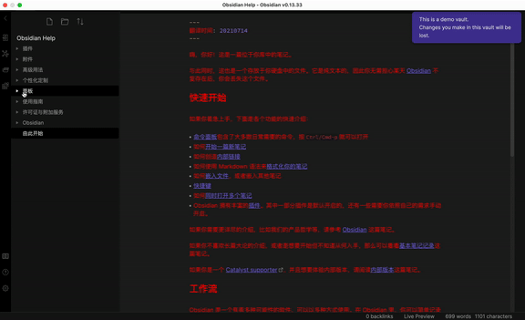
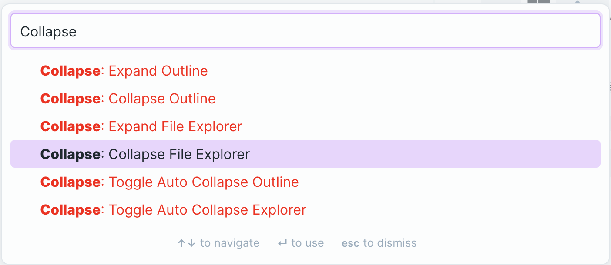

## Obsidian Collapse

> Collapse/Expand file explorer, outline (maybe more if needed) automatically responding to current location. Of course, all are optional!

### Auto Collapse

| Auto Collapse Outline                               |
| --------------------------------------------------- |
|  |

| Auto Collapse Explorer                               |
| --------------------------------------------------- |
|  |

### Commands

| Commands                   |
| -------------------------- |
|  |

## License

MIT
